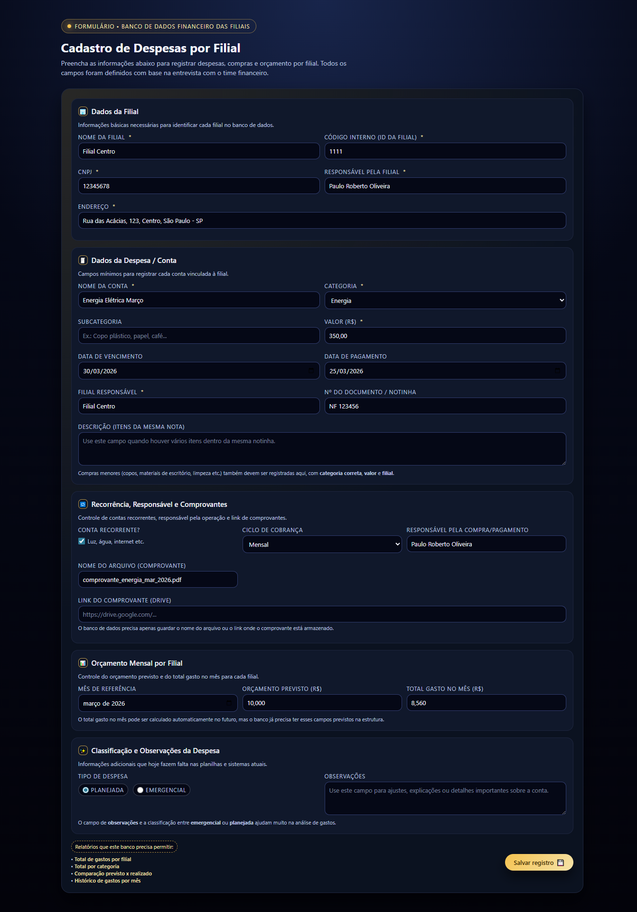
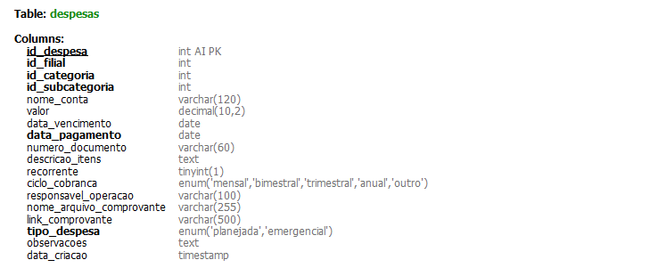
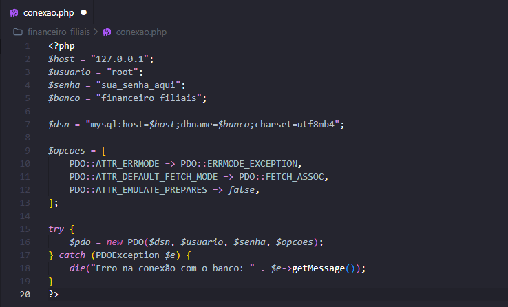

# ❀ Sistema de Despesas com Modelagem de Banco de Dados 

Aplicação web desenvolvida com foco em **modelagem de banco de dados e integração com aplicação web**, permitindo o registro e controle de despesas empresariais.

---

## ❀ Objetivo do Projeto

Este projeto teve como objetivo desenvolver uma aplicação web integrada a um banco de dados relacional, com foco em:

• Estruturação e modelagem de banco de dados  
• Integração entre aplicação e MySQL utilizando PHP  
• Registro e organização de despesas  

✿ **Observação:**  
A aplicação foi desenvolvida com auxílio de Inteligência Artificial, porém o foco principal esteve na **estrutura do banco de dados e na conexão com o sistema via XAMPP**.

---

## ❀ Tópicos Estudados

Modelagem de banco de dados relacional  
Criação de tabelas e relacionamentos (MySQL)  
Integração PHP com MySQL (PDO)  
Manipulação de dados via formulário (POST)  
Estruturação de aplicações web  
Uso de ambiente local com XAMPP  

---

## ❀ Ferramentas Utilizadas

• MySQL Workbench  
• VS Code  
• XAMPP (Apache + MySQL)  
• InfinityFree (deploy da aplicação)  
• Inteligência Artificial (auxílio no desenvolvimento)  

---

## ❀ O que foi pedido

Desenvolver uma aplicação web para uma empresa que:

Permitisse o cadastro de despesas  
Armazenasse os dados em banco relacional  
Possuísse estrutura organizada de tabelas  
Realizasse integração entre aplicação e banco de dados  

---

## ❀ O que foi realizado

✿ Criação do banco de dados `financeiro_filiais`  

✿ Modelagem das tabelas:
- despesas  
- filiais  
- categorias_despesa  
- subcategorias_despesa  
- orcamentos_mensais  

• Desenvolvimento de formulário web completo  
• Integração com banco de dados via PHP (PDO)  
• Persistência de dados no banco  
• Organização da estrutura do projeto  

---

## ❀ Demonstração da Aplicação

### ✿ Interface do sistema

### ✿ Formulário preenchido

---

## ❀ Persistência de Dados

### ✿ Confirmação de salvamento

### ✿ Dados armazenados no banco

---

## ❀ Estrutura do Banco de Dados

---

## ❀ Integração com PHP

---

## ❀ Principais Aprendizados

Estruturação de banco de dados voltado para aplicação real  
Conexão entre PHP e MySQL utilizando PDO  
Importância da organização de dados e tabelas  
Manipulação de dados via formulário  
Noções básicas de deploy de aplicações web  

---

## ❀ Conclusão

Este projeto foi fundamental para consolidar conhecimentos sobre **banco de dados e integração com aplicações web**.

Mesmo com o uso de Inteligência Artificial no desenvolvimento da interface, o principal foco foi compreender:

✿ Como os dados são estruturados  
✿ Como são armazenados  
✿ Como ocorre a comunicação entre aplicação e banco  
